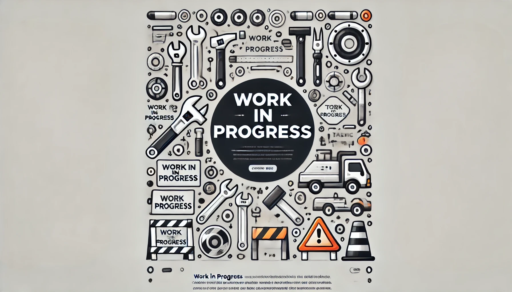

# TruckersMP Google Calendar Sync

A Python application that fetches TruckersMP events and synchronizes them with a Google Calendar. Users can log in with their Gmail account and automatically add upcoming ETS2 events to their calendar.

Features
- **Fetch Events**: Retrieves events from the TruckersMP API.
- **Filter by Game**: Only synchronizes events related to ETS2. In future extend it to ATS.
- **Google Calendar Integration**: Automatically adds events to your specified Google Calendar.
- **OAuth Authentication**: Secure login with Gmail using Google OAuth 2.0.

## Contributing

Contributions are welcome! Feel free to open issues or submit pull requests to improve the project.

## License

This project is licensed under the MIT License.

